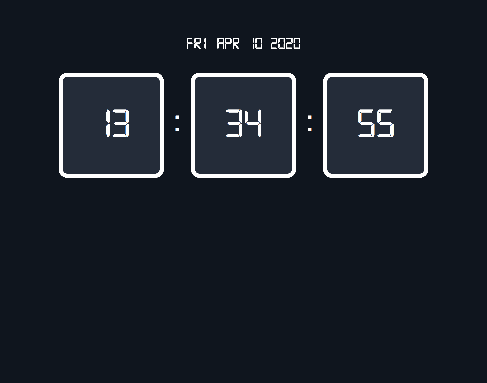

# Clock

Simple vanilla JavaScript clock

## Requirements:

### Style

- Font name has to be `digital`
- Font color has to be `white`
- Background color has to be `#0e151f`
- Body font size is `40px`
- Clock number font size is `100px`
- Clock number box size is `2.5em` by `2.5em`
- Clock number box has to have a `white` border of `0.1em` and it has be included in the box size
- Clock number box color is `#222c3a`

### Logic

- You can't change the given HTML index file
- Updates every second
- Minutes and seconds have to have a leading `0` if minor than 10

